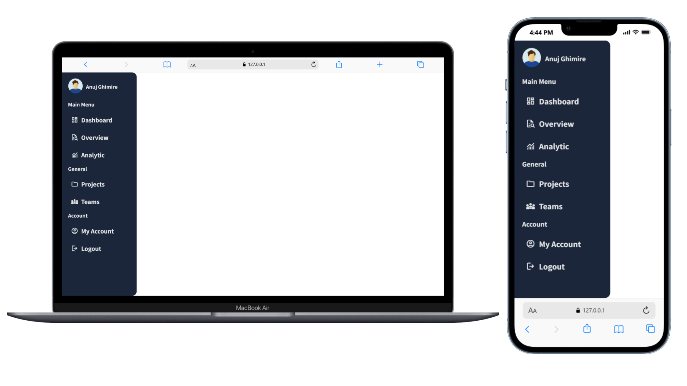

<p align="center">
  
</p>

<p align="center">
  
</p>

---

<p align="center">
  
  
  
</p>

---

# 📚 Sidebar Navigation UI

A clean and minimal **Sidebar Navigation UI** built using **HTML & CSS**.  
This sidebar is perfect for **Dashboards, Admin Panels, Web Apps**, and **Portfolio Projects**.

The interface includes:

- Profile section  
- Multiple menu categories (Main Menu, General, Account)  
- Google Material Icons  
- Responsive and modern design theme  
- Smooth hover effects  

---


## 📸 Preview




--

## 🔗 Live Demo

<p align="center">
  <a href="https://anujghimire08.github.io/SlideBar/">
    
  </a>
</p>

---

## 🎯 UI Features

- Fixed sidebar layout  
- Clean and modern dark theme  
- Google Material Symbols icons  
- Responsive text & icon alignment  
- Smooth hover animations  
- Organized menu sections:  
  - **Main Menu**  
  - **General**  
  - **Account**  
- Fully customizable and lightweight  

---

## 📁 Folder Structure

```text
sidebar-navigation-ui/
├── index.html              # Base HTML structure
├── style.css               # Sidebar UI styling
└── man-user-circle-icon.png  # Profile image

